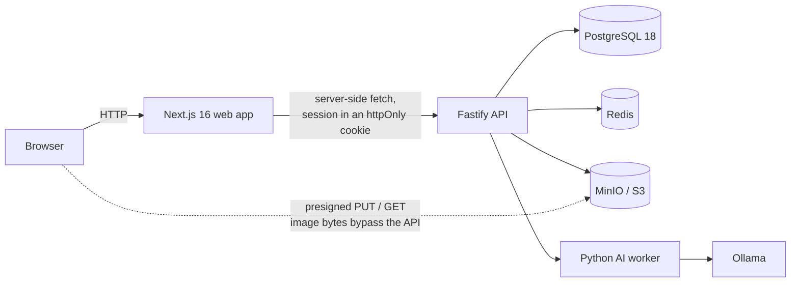

<div align="center">

# LocalCanvas AI

**A privacy-first, self-hosted AI photo editor** — edit images, rewrite the text inside them, remove objects and run a client workflow, with the AI on your own hardware.

[](#project-status)
[](#local-ai)
[](#ownership)

</div>

> **This repository is a portfolio case study, not a source mirror.** The implementation is private. See [Ownership](#ownership).

---

## The idea

Every photo editor with "AI features" sends your images to somebody else's server. For a lot of people that is a deal-breaker — law firms, clinics, agencies under NDA, anyone handling client material, anyone in a jurisdiction with data-residency rules.

LocalCanvas AI runs entirely on your own machine, in Docker. Your files, your prompts and your project data are not transmitted anywhere. The AI runs locally instead of through a cloud API.

The differentiator is **text inside images**. Not just OCR that reads it — the ability to detect text in a photograph, then correct it, redact it, remove it or replace it, non-destructively. That is a job people currently do badly in Photoshop and would rather not do at all.

---

## Where it stands

**Phase 3 of 11.** The foundation, identity and tenancy, and the project and storage layers are built and verified. **The editor itself is not written yet** — it is Phase 4 and it is the next thing to be built.

Being direct about this is deliberate. This page describes what exists, not what is planned, and the line between the two is marked everywhere.

### What works today

| Layer | State |
| :--- | :--- |
| Monorepo, strict TypeScript, lint, hooks, CI | Working |
| PostgreSQL schema, migrations, deterministic seed | Working |
| Typed config with production guards | Working |
| Fastify API: redaction, security headers, rate limiting, OpenAPI | Working |
| Authorization: 27 permissions, 8 roles, enforced server-side | Working |
| Identity: sessions, lockout, password reset, privilege epochs | Working |
| Multi-tenant isolation — proven, not asserted | Working |
| Projects: CRUD, revisions, trash/restore, pagination | Working |
| Storage: direct-to-MinIO uploads via presigned URLs | Working |
| Byte-level image validation and decompression-bomb defence | Working |
| Web: auth, workspace, members, projects, upload panel | Working |
| Python AI worker with a capability registry | Working |
| **The photo editor** | **Not started — Phase 4** |
| **OCRed, editable text inside images** | **Not started — Phase 5** |
| **Object removal** | **Blocked — see below** |

---

## Architecture



A modular monolith with a separate AI worker and a hard boundary around the local models:

- **Web** talks only to the API. It holds no business rules.
- **API** owns authorization, validation and every state transition.
- **Worker** runs inference. It is never exposed to the browser and requires a shared secret on every request.
- **Object storage** holds the images. The API mints presigned URLs; the bytes never transit the API.

Shared packages carry types, configuration, permissions, storage contracts and the audit vocabulary across all three runtimes, so a contract change is a compile-time error rather than a runtime surprise.

---

## Technical highlights

**Privacy enforced by architecture, not policy.** There is no cloud AI provider in the default path. The worker's HTTP client is explicitly configured not to honour `HTTP_PROXY` — an ambient proxy would otherwise route a request intended for loopback Ollama off the machine. That was a real bug, found by a test, and it is exactly the kind of thing a "we don't send your data anywhere" claim dies from.

**Images are validated by reading their bytes.** Not by trusting `Content-Type`. The API identifies PNG, JPEG, GIF, WebP, BMP, AVIF, HEIC, TIFF and SVG from their magic numbers, and extracts dimensions from the image headers. A file that claims to be a PNG and contains HTML is rejected with a readable reason. SVG is separately flagged as requiring sanitisation, because SVG is XML and can carry script.

**Decompression bombs are refused before allocation.** Validation is header-only, with per-side and total-pixel ceilings, so a file declaring `50000×50000` is rejected without anything being allocated.

**Uploads bypass the API entirely.** The client asks the API for a presigned `PUT`, uploads straight to object storage, then asks the API to finalize. The API reads back the first 64 KB and verifies what actually landed. This keeps large uploads off the application server's heap without giving up server-side validation.

**Object keys are workspace-scoped as a security control.** Keys are `ws/<workspaceId>/...`, so a presigned URL minted for one tenant cannot address another tenant's object even if the key were guessed. `keyBelongsToWorkspace()` exists to assert that.

**Tenant isolation is proven, not asserted.** Every workspace-scoped endpoint has a cross-tenant denial case, and foreign-workspace responses are asserted **byte-identical** to not-found responses — the API cannot be used as an existence oracle. Revoking another user's session returns 404, not 403.

**Two bugs only the real thing could find.** The integration suite ran green against a fake storage layer, and then a real MinIO run surfaced two problems the fake could not: a rejected upload left its bytes in the bucket, and downloads served the client's *declared* content type rather than the type detected from the bytes. Both are fixed. The fake proves the wiring; the real run proves the behaviour.

**Sessions invalidate by privilege epoch.** A role change bumps an epoch, and the affected user's existing sessions die immediately rather than at the next natural expiry.

**Non-destructive by construction.** The original asset is immutable. Edits are operations recorded against a versioned document schema with its own migration path — history is a first-class feature, not an implementation detail.

**Audit writes share the transaction.** Sensitive operations and their audit records commit together, so there is no window where a change exists unrecorded.

---

## Engineering challenges

- **Making "nothing leaves this machine" verifiable.** A privacy claim is only worth what its enforcement is worth. That meant closing the proxy leak, pinning the model host, and adding a CI licence scan that fails the build if a copyleft dependency enters the shipped tree.
- **Trusting nothing the client says.** Content type, filename and declared dimensions are all provisional until the bytes are read.
- **Validating large uploads without holding them.** Header-range reads and presigning, so a 100 MB file is checked without ever being buffered.
- **Keeping copyleft at arm's length.** MinIO is AGPL and libheif is LGPL. Both stay unmodified, isolated services behind a network boundary, with the reasoning recorded rather than assumed.
- **Testing honestly.** A green build proves very little about a page. There is a runtime harness that issues real HTTP to every route and asserts each renders its own content rather than an error boundary — including a check that an API outage does **not** look to the user like a lost session.

---

## Local AI

Local models via Ollama, on your hardware, with no external calls:

| Job | Model |
| :--- | :--- |
| Chat and editing intent | `qwen3:4b` |
| Vision and captioning | `qwen3-vl:4b` |
| Text detection in images | Lightweight ONNX detector (planned, Phase 5) |

**Honest note on object removal.** The inpainting weights this feature depends on carry **no licence statement** and are widely reported as non-commercial. Rather than ship it and hope, the adapter is registered as *permanently blocked* in the worker's capability registry, the reason is surfaced to the operator, and a test asserts it can never report as available. The headline feature is genuinely gated on a legal question, and that is stated rather than hidden.

---

## Technology

| Layer | Stack |
| :--- | :--- |
| **Web** | Next.js 16 (App Router, Turbopack), React 19, TypeScript 6 |
| **API** | Fastify 5 with zod-validated contracts |
| **Data** | PostgreSQL 18 with Prisma 7 |
| **Cache / queues** | Redis |
| **Object storage** | MinIO (S3-compatible), presigned direct uploads |
| **AI worker** | Python, FastAPI, Ollama |
| **Auth** | Argon2id, server-side sessions, privilege epochs, server-enforced RBAC |
| **Testing** | Vitest, pytest, a custom runtime HTTP harness |
| **CI** | GitHub Actions (lint, typecheck, tests, build, compose validation, licence scan) |

---

## Repository layout

```
apps/
  api/          Fastify API
  web/          Next.js application
  ai-worker/    Python FastAPI inference worker
packages/
  contracts/    zod schemas and errors shared by every runtime
  config/       typed environment configuration
  authorization/ permission catalog, role matrix, tenant boundary
  auth/         Argon2id, tokens, session primitives
  identity/     users, sessions, invitations, workerspaces
  projects/     project and asset services, upload policy, image detection
  storage/      S3/MinIO client, presigning, object-key policy
  audit/        audit vocabulary and writer
  database/     Prisma schema, migrations, tenant-scoped helpers, seed
  editor-core/  versioned editor document schema and migrations
docs/           product, architecture, security model, decisions, handover
infra/          Docker, CI helpers, verification scripts
```

---

## Project status

**Active development, Phase 3 of 11.**

Phases 1–3 are built and verified: foundation, identity and tenancy, and the
project and storage layer. The editor (Phase 4), the text-in-image pipeline
(Phase 5) and the AI job system (Phase 6) are ahead.

A full phase-by-phase ledger with `Not started` / `Blocked` / `Implemented` /
`Tested` / `Accepted` labels lives in `docs/IMPLEMENTATION_STATUS.md`. Nothing is
marked `Accepted` on the strength of a build.

Real limitations, stated plainly:

| Limitation | Status |
| :--- | :--- |
| No photo editor yet | Phase 4 |
| No text detection or editing in images yet | Phase 5 |
| Object removal blocked on a model-weight licence | Blocked |
| Two-factor authentication not shipped | Blocked on sequencing |
| Licence not yet chosen | Owner decision |

---

## Ownership

Built by **Altin** ([@ulasmango-cmd](https://github.com/ulasmango-cmd)).

- GitHub profile: [github.com/ulasmango-cmd](https://github.com/ulasmango-cmd)

---

## Licence

The implementation is **private and proprietary**. This repository contains
portfolio documentation and product screenshots only — it intentionally does not
include application source code, business logic, infrastructure configuration or
credentials.

© Altin. All rights reserved.
